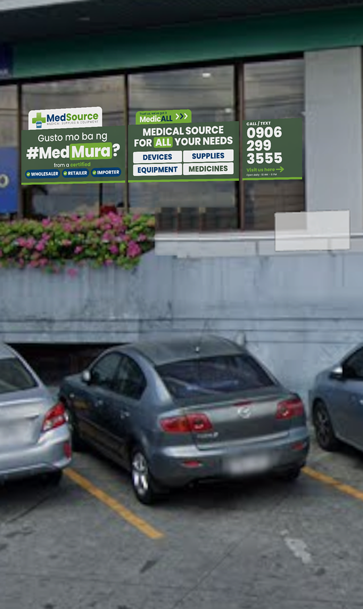

# MedSource Media

Every MedSource publication in one place: social posts, signage and print, plus the logos. Images here are public so Metricool can schedule them. Brand rules live in the [MedSource Design System](https://claude.ai/artifact/LojEEUnecRaNcobaZvbXQ8).

## Social posts

| Date | Publication | Branch | Status | Preview |
| --- | --- | --- | --- | --- |
| Oct 8, 2026 | [Now Accepting DSWD Guarantee Letters](posts/2026-10-08-dswd-guarantee-letters/post.md) | Sta. Lucia Mall | Scheduled |  |

## Signage & print

| Date | Piece | Location | Status | Preview |
| --- | --- | --- | --- | --- |
| Oct 2026 | [Warehouse Window Sticker](print/2026-10-warehouse-window-sticker/print.md) | Warehouse glass wall | Approved |  |

## Brand kit

Everything needed for flyers, tarps, documents and posts. Every logo comes as SVG (vector, send this to printers) and PNG (2000px wide, for Canva, Word and quick use).

| MedSource landscape | MedSource portrait | MedSource icon | MedSource World | World icon |
| --- | --- | --- | --- | --- |
|  |  |  |  |  |

- [`brand/logos/medsource`](brand/logos/medsource): official MedSource logos (landscape, portrait, icon), full colour and white
- [`brand/logos/medsource-world`](brand/logos/medsource-world): official MedSource World logo and globe icon, full colour and white
- [`brand/logos/signage`](brand/logos/signage): rebalanced logos for big-format signage only (larger wordmark), never for documents or posts
- [`brand/fonts/poppins`](brand/fonts/poppins): Poppins, the only brand font (Light to Black, with italics; free licence in OFL.txt)
- [`brand/guidelines`](brand/guidelines): brand guide, publication rules, decisions log and colour/type tokens

**Colours:** Forest `#445C44` · Navy `#033F75` · Brand green `#7AB537` · Navy deep `#022A4F` · White `#FFFFFF`
**Taglines:** Certified #Med**Mura** · Trust us, we've got it Medic**ALL**
**Rules:** white logo on forest, navy or photos; full colour on white only. No em dashes in any copy.

## Folder guide

- `posts/YYYY-MM-DD-slug/`: feed (1080×1350) and story (1080×1920) PNGs plus `post.md` with captions and schedule
- `print/YYYY-MM-slug/`: print-ready PDFs at actual size, mockups and `print.md`
- `brand/`: logos, fonts and guidelines
