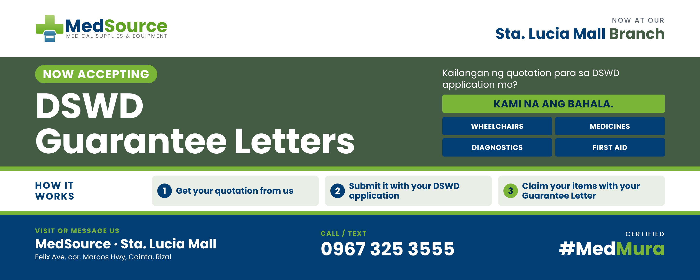

# DSWD Tarpaulin 2 x 5 ft

| | |
| --- | --- |
| Date | Oct 10, 2026 |
| Type | Signage, tarpaulin |
| Size | 60 × 24 in (5 ft wide, 2 ft tall, landscape) |
| Location | Sta. Lucia Mall branch |
| Status | Draft |
| Design | [source.html](source.html) (no design canvas) |

"Now accepting DSWD Guarantee Letters" for the Sta. Lucia Mall branch. Same message as the Oct 8 social post, laid out as a landscape tarp: logo and branch on white, forest hero band with the green "Now accepting" pill, product tiles, three-step strip, navy footer with the phone number as the biggest line. Full-colour signage logo, Poppins only, no DSWD seal or logo.

## Print files (vector PDF, actual size)

| File | Size |
| --- | --- |
| [tarpaulin-60x24in.pdf](tarpaulin-60x24in.pdf) | 60 × 24 in, fonts embedded, vector |

Layout is at 96 px per inch (5760 × 2304 px). Side safe margin 3 in, top and bottom 1.2 in. No bleed added: ask the printer if they need extra for the hem, and extend the bands if so.

## Preview

## Copy

- NOW ACCEPTING / DSWD Guarantee Letters
- Kailangan ng quotation para sa DSWD application mo? KAMI NA ANG BAHALA.
- Wheelchairs · Medicines · Diagnostics · First aid
- How it works: 1 Get your quotation from us. 2 Submit it with your DSWD application. 3 Claim your items with your Guarantee Letter.
- MedSource · Sta. Lucia Mall, Felix Ave. cor. Marcos Hwy, Cainta, Rizal
- Call / text 0967 325 3555
- Certified #MedMura
