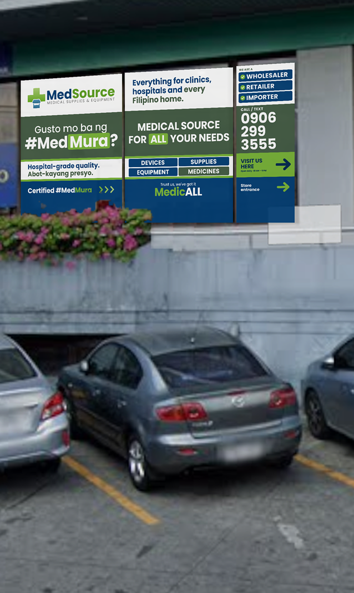
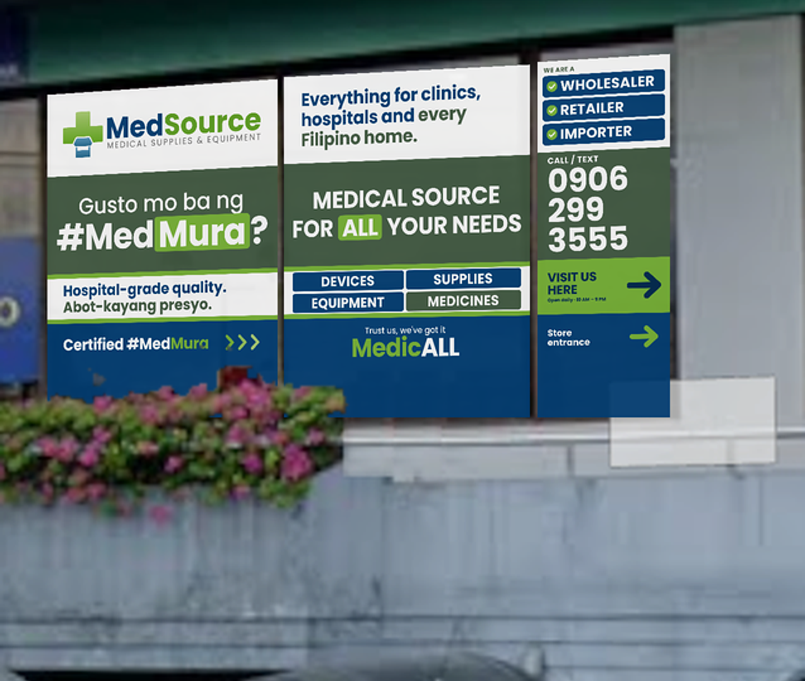
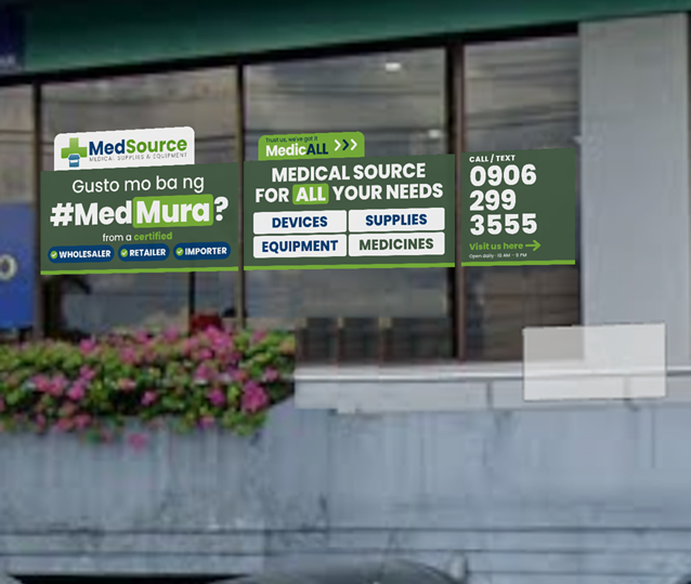

# Warehouse Window Sticker

| | |
| --- | --- |
| Date | Oct 2026 |
| Type | Signage, glass sticker |
| Location | Warehouse, street-facing glass wall (entrance to the right) |
| Status | Approved |
| Design | [Open canvas](https://claude.ai/artifact/JuGC8k18WWiaK2PAsviFfz) |

Three panels read left to right as one wall: hook, what we have, call and visit. Key content stays in the top 70% because planters, cars and people hide the bottom third. Print on white-backed vinyl so colours stay true on glass.

## Print files (vector PDF, actual size)

| Panel | Size | Style A · Full | Style B · Minimal band |
| --- | --- | --- | --- |
| 1 | 35.24 × 44.84 in | [PDF](style-a-full/panel-1-35.24x44.84in.pdf) | [PDF](style-b-minimal-band/panel-1-35.24x44.84in.pdf) |
| 2 | 35.24 × 44.84 in | [PDF](style-a-full/panel-2-35.24x44.84in.pdf) | [PDF](style-b-minimal-band/panel-2-35.24x44.84in.pdf) |
| 3 | 16.57 × 44.84 in | [PDF](style-a-full/panel-3-16.57x44.84in.pdf) | [PDF](style-b-minimal-band/panel-3-16.57x44.84in.pdf) |

Style B panels have a transparent background outside the band (clear glass).

## Mockups

| Style A · Full | Style B · Minimal band |
| --- | --- |
|  |  |
|  |  |
